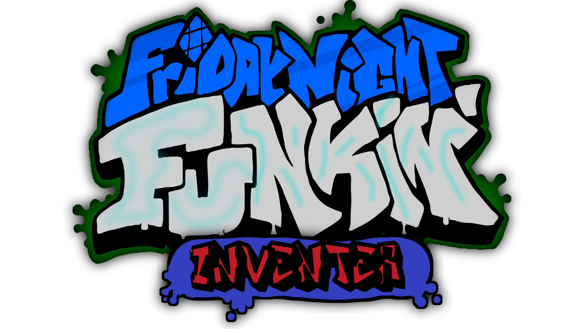
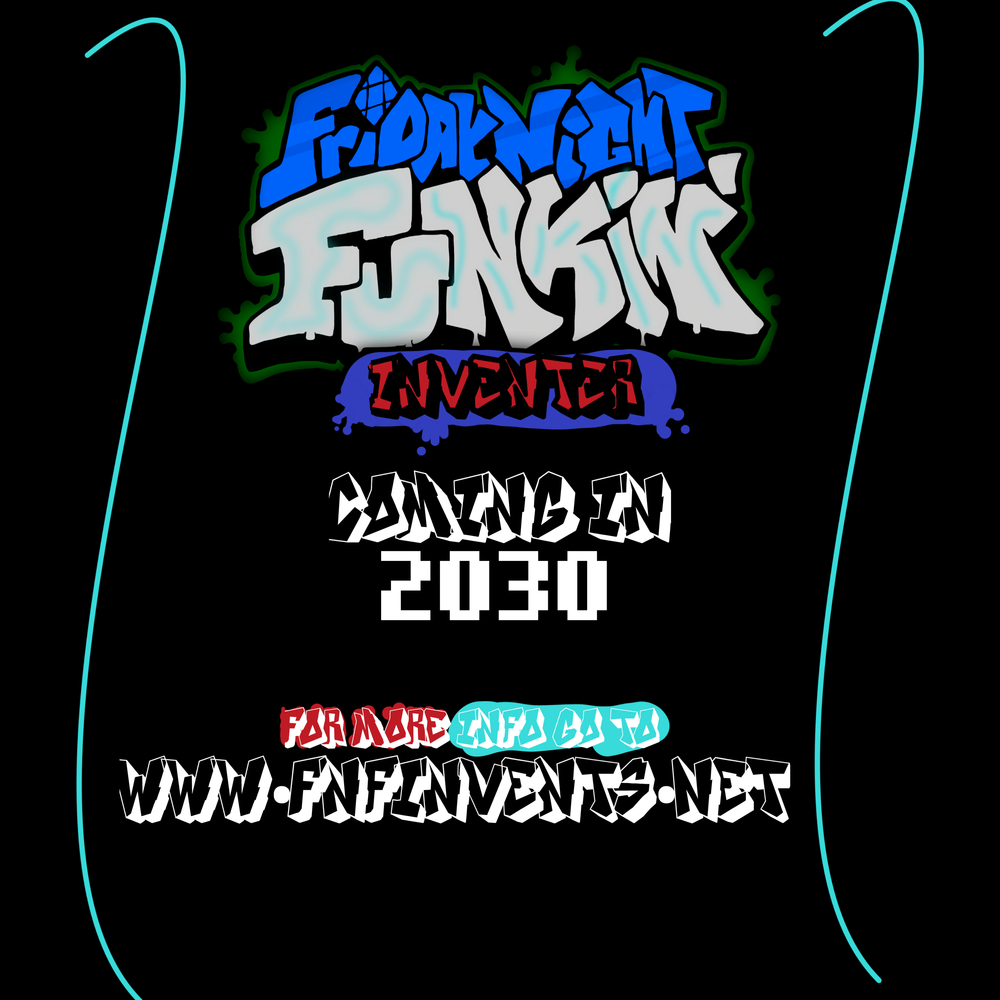

> an un-finished mod (Inventer which... uh.) with huuuuge plans on it
(this mod has no point cuz it is just still plans)

you can't [download the beta here](https://www.youtube.com/watch/dQw4w9WgXcQ) which is very unstable

no screenshots but here are the
## Poster



NOTICE: the link is not working cause the page isn't available for public, and don't mind the release date it's still a plan

again, when you download the beta i recommend you hold up until we reach the stable build (useless)

-------------------


a Game originally made for Ludum Dare 47 "Stuck In a Loop".

> Uh oh! Your tryin to kiss ur hot girlfriend, but her MEAN and EVIL dad is trying to KILL you! He's an ex-rockstar, the only way to get to his heart? The power of music... 

Play the Ludum Dare prototype here: https://ninja-muffin24.itch.io/friday-night-funkin
Play the Newgrounds one here: https://www.newgrounds.com/portal/view/770371
Support the project on the itch.io page: https://ninja-muffin24.itch.io/funkin

IF YOU MAKE A MOD AND DISTRIBUTE A MODIFIED / RECOMPILED VERSION, YOU MUST OPEN SOURCE YOUR MOD AS WELL

### Credits / shoutouts

- [ninjamuffin99](https://twitter.com/ninja_muffin99) - Programmer
- [PhantomArcade3K](https://twitter.com/phantomarcade3k) and [Evilsk8r](https://twitter.com/evilsk8r) - Art
- [Kawaisprite](https://twitter.com/kawaisprite) - Musician

FNF was made with love to Newgrounds and its community. Extra love to Tom Fulp.

## Build instructions

THESE INSTRUCTIONS ARE FOR COMPILING THE FNF'S SOURCE CODE!!!

IF YOU WANT TO JUST DOWNLOAD AND INSTALL AND PLAY FNF NORMALLY, GO TO ITCH.IO TO DOWNLOAD THE GAME FOR PC, MAC, AND LINUX!!

https://ninja-muffin24.itch.io/funkin

IF YOU WANT TO COMPILE FNF YOURSELF, CONTINUE READING!!!

### Installing the Required Programs

First, you need to install Haxe and HaxeFlixel. I'm too lazy to write and keep updated with that setup (which is pretty simple). 
1. [Install Haxe 4.1.5](https://haxe.org/download/version/4.1.5/) (Download 4.1.5 instead of 4.2.0 because 4.2.0 is broken and is not working with gits properly...)
2. [Install HaxeFlixel](https://haxeflixel.com/documentation/install-haxeflixel/) after downloading Haxe

Other installations you'd need are the additional libraries, a fully updated list will be in `Project.xml` in the project root. Currently, these are all of the things you need to install:
```
flixel
flixel-addons
flixel-ui
hscript
newgrounds
```
So for each of those type `haxelib install [library]` so shit like `haxelib install newgrounds`

You'll also need to install a couple things that involve Gits. To do this, you need to do a few things first.
1. Download [git-scm](https://git-scm.com/downloads). Works for Windows, Mac, and Linux, just select your build.
2. Follow instructions to install the application properly.
3. Run `haxelib git polymod https://github.com/larsiusprime/polymod.git` to install Polymod.
4. Run `haxelib git discord_rpc https://github.com/Aidan63/linc_discord-rpc` to install Discord RPC.

You should have everything ready for compiling the game! Follow the guide below to continue!

At the moment, you can optionally fix the transition bug in songs with zoomed-out cameras.
- Run `haxelib git flixel-addons https://github.com/HaxeFlixel/flixel-addons` in the terminal/command-prompt.

### Ignored files (FNF)

ninjamuffin99 gitignore the API keys for the game so that no one can nab them and post fake high scores on the leaderboards. But because of that the game
doesn't compile without it.

Just make a file in `/source` and call it `APIStuff.hx`, and copy & paste this into it

```haxe
package;

class APIStuff
{
	public static var API:String = "";
	public static var EncKey:String = "";
}

```

and you should be good to go there.

### Compiling FNF
NOTE: If you see any messages relating to deprecated packages, ignore them. They're just warnings that don't affect compiling

Once you have all those installed, it's pretty easy to compile the game. You just need to run `lime test html5 -debug` in the root of the project to build and run the HTML5 version. (command prompt navigation guide can be found here: [https://ninjamuffin99.newgrounds.com/news/post/1090480](https://ninjamuffin99.newgrounds.com/news/post/1090480))
To run it from your desktop (Windows, Mac, Linux) it can be a bit more involved. For Linux, you only need to open a terminal in the project directory and run `lime test linux -debug` and then run the executable file in export/release/linux/bin. For Windows, you need to install Visual Studio Community 2019. While installing VSC, don't click on any of the options to install workloads. Instead, go to the individual components tab and choose the following:
* MSVC v142 - VS 2019 C++ x64/x86 build tools
* Windows SDK (10.0.17763.0)

Once that is done you can open up a command line in the project's directory and run `lime test windows -debug`. Once that command finishes (it takes forever even on a higher end PC), you can run FNF from the .exe file under export\release\windows\bin
As for Mac, 'lime test mac -debug' should work, if not the internet surely has a guide on how to compile Haxe stuff for Mac.

### Additional guides

- [Command line basics](https://ninjamuffin99.newgrounds.com/news/post/1090480)

-----------------------
that is the original game desc
